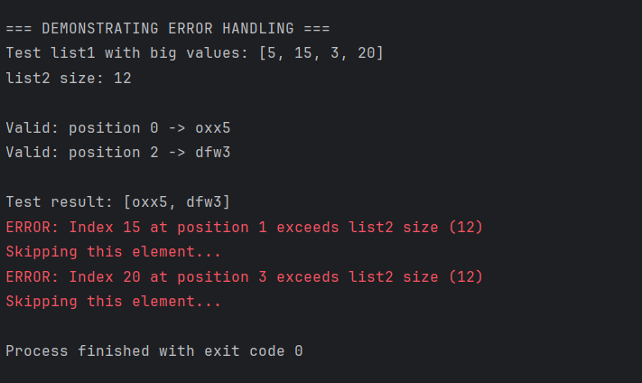

# List Management Program

## 📋 Project Overview

This Java program implements a **list processing algorithm** that combines elements from two input lists to create a result list. The program demonstrates core **Object-Oriented Programming (OOP)** principles and proper error handling techniques.

## 🎯 Algorithm Description

The program works with three lists:

1. **`list1`** - Contains integer values that serve as indices
2. **`list2`** - Contains string values to be accessed
3. **`list3`** - Contains the combined result

### 🔄 Processing Steps

1. **Iterate** through each element in `list1`
2. **Use** the integer value as an index to access `list2`
3. **Combine** the accessed string with the integer value
4. **Add** the combined result to `list3`

### 📊 Example

```
list1[0] = 6 → list2[6] = "oxx" → result: "oxx6"
list1[1] = 3 → list2[3] = "dcn" → result: "dcn3"
list1[2] = 8 → list2[8] = "feu" → result: "feu8"
```

## 📦 Package Structure

```
oop.final.t1/
└── ListManagement.java
```

## 🚀 How to Run

### Prerequisites
- **Java Development Kit (JDK) 8** or higher
- **IntelliJ IDEA** (or any Java IDE)

### Step-by-Step Instructions

1. **Create a new Java project** in IntelliJ IDEA
2. **Create package structure**:
    - Right-click on `src` folder
    - Select `New` → `Package`
    - Enter package name: `oop.final.t1`
3. **Create the Java class**:
    - Right-click on the package `oop.final.t1`
    - Select `New` → `Java Class`
    - Enter class name: `ListManagement`
4. **Copy and paste** the provided code
5. **Run the program**:
    - Right-click on `ListManagement.java`
    - Select `Run 'ListManagement.main()'`

## ⚠️ Error Handling

The program includes **comprehensive error handling** for scenarios where integer values from `list1` exceed the bounds of `list2`.

### Error Scenarios

- **Index Out of Bounds**: When `list1[i] >= list2.size()`
- **Behavior**: The program prints an error message and skips the problematic element
- **Continuation**: Processing continues with the remaining valid elements

### Error Handling Implementation

```java
if (index >= list2.size()) {
    System.err.println("Error: Index " + index + " at position " + i + 
                     " is out of bounds for list2 (size: " + list2.size() + ")");
    System.err.println("Skipping element at position " + i);
    continue; // Skip this element and continue with next
}
```

### 📸 Error Handling Screenshot

The program includes a `demonstrateErrorHandling()` method that creates test scenarios with values exceeding `list2` bounds:



**Test Scenario:**
- `list1 = [5, 15, 3, 20]`
- `list2.size() = 12`
- Indices `15` and `20` are **out of bounds**

**Expected Output:**
```
ERROR: Index 15 at position 1 exceeds list2 size (12)
Skipping this element...
ERROR: Index 20 at position 3 exceeds list2 size (12)
Skipping this element...
```

**Valid Results:**
- Position 0: `5 → "cac5"`
- Position 2: `3 → "dcn3"`

## 🏗️ Project Structure

```
📁 Project Root
├── 📁 src
│   └── 📁 oop
│       └── 📁 final
│           └── 📁 t1
│               └── 📄 ListManagement.java
├── 📄 README.md
└── 📄 .gitignore (optional)
```

## 📝 Features

- ✅ **Complete algorithm implementation**
- ✅ **Comprehensive error handling**
- ✅ **Detailed JavaDoc documentation**
- ✅ **Input validation**
- ✅ **Formatted output display**
- ✅ **Error demonstration functionality**

## 🎓 Learning Objectives

This program demonstrates:

1. **List manipulation** and iteration
2. **Error handling** with try-catch-like logic
3. **Object-Oriented Programming** principles
4. **Method documentation** with JavaDoc
5. **Console output formatting**
6. **Index-based data access**

## 🔧 Troubleshooting

### Common Issues

1. **Package Declaration Error**
    - Ensure the package name matches the folder structure
    - Use: `package oop.final.t1;`

2. **Compilation Errors**
    - Check Java version compatibility
    - Verify all imports are correct

3. **Runtime Errors**
    - The program handles index out of bounds automatically
    - Check console output for error messages

## 📚 Additional Resources

- [Java Documentation](https://docs.oracle.com/en/java/)
- [IntelliJ IDEA Guide](https://www.jetbrains.com/help/idea/)
- [Java Collections Framework](https://docs.oracle.com/javase/8/docs/technotes/guides/collections/)